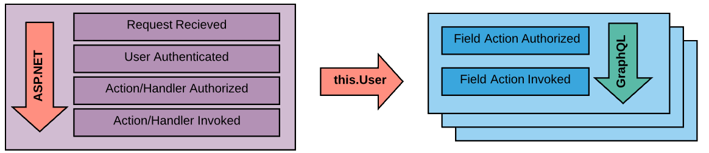

## Quick Examples 

If you've wired up ASP.NET authorization before, you'll likely familiar with the `[Authorize]` attribute and how its used to enforce security. GraphQL ASP.NET works the same way.

```csharp
// BakeryController.cs
public class BakeryController : GraphController
{
    [Authorize]
    [MutationRoot("orderDonuts", typeof(CompletedDonutOrder))]
    public async Task<IGraphActionResult> OrderDonuts(DonutOrderModel order)
    {/*...*/}
}
```

Need to restrict by policy?

```csharp
// BakeryController.cs
public class BakeryController : GraphController
{
    [Authorize(Policy = "CustomerLoyaltyProgram")]
    [MutationRoot("orderDonuts", typeof(CompletedDonutOrder))]
    public async Task<IGraphActionResult> OrderDonuts(DonutOrderModel order)
    {/*...*/}
}
```

How about by Role?

```csharp
// BakeryController.cs
public class BakeryController : GraphController
{
    [Authorize(Roles = "Admin, Employee")]
    [MutationRoot("purchaseDough")]
    public async Task<bool> PurchaseDough(int kilosOfDough)
    {/*...*/}
}
```

This library supports nested policy and role checks at Controller and Action levels.

```csharp
// BakeryController.cs
[Authorize(Policy = "CurrentCustomer")]
public class BakeryController : GraphController
{
    [Authorize(Policy = "LoyaltyProgram")]
    [MutationRoot("orderDonuts", typeof(CompletedDonutOrder))]
    public async Task<IGraphActionResult> OrderDonuts(DonutOrderModel order)
    {/*...*/}
}
```

And overrides with `[AllowAnonymous]`...

```csharp
// BakeryController.cs
[Authorize]
public class BakeryController : GraphController
{
    [Authorize(Policy = "CustomerLoyaltyProgram")]
    [MutationRoot("orderDonuts", typeof(CompletedDonutOrder))]
    public async Task<IGraphActionResult> OrderDonuts(DonutOrderModel order)
    {/*...*/}

    [AllowAnonymous]
    [Mutation("donutList")]
    public async Task<IEnumerable<Donut>> RetrieveDonutList()
    {/*...*/}
}
```

## Use of IAuthorizationService

Under the hood, GraphQL taps into your `IServiceProvider` to obtain a reference to the `IAuthorizationService` that gets created when you configure `.AddAuthorization()` for policy enforcement rules. Take a look at the [Schema Item Authorization Pipeline](https://github.com/graphql-aspnet/graphql-aspnet/tree/master/src/graphql-aspnet/Middleware/SchemaItemSecurity) for the full picture.

## When does Authorization Occur?



_The Default "per field" Authorization workflow_

---

In the diagram above we can see that user authorization in GraphQL ASP.NET makes use of the result from [ASP.NET's security pipeline](https://docs.microsoft.com/en-us/aspnet/core/security/authorization/introduction). Whether you use Kerberos tokens, oauth2, username/password, API tokens or if you support 2-factor authentication or one-time-use passwords, GraphQL doesn't care. The entirety of your authentication and authorization scheme is executed by GraphQL, no special arrangements or configuration is needed.

> GraphQL ASP.NET draws from your configured authentication/authorization solution.

Execution directives and field resolutions are passed through a [pipeline](../reference/how-it-works#middleware-pipelines) where authorization is enforced as a series of middleware components before the respective handlers are invoked. Should a requestor not be authorized for a given schema item an action is taken:


## Field Authorizations

If a requestor is not authorized to a requested field a value of `null` is used as the resolved value and an error message is recorded to the query results. 

Null propagation rules still apply to unauthorized fields meaning if the field cannot accept a null value, its propagated up the field chain potentially nulling out a parent or "parent of a parent" depending on your schema.

By default, a single unauthorized field result does not necessarily kill an entire query, it depends on the structure of your object graph and the query being executed. When a field request is terminated any down-stream child fields are discarded immediately but sibling fields or unrelated ancestors continue to execute as normal.

Since this authorization occurs "per field" and not "per controller action" its possible to define the same security chain for POCO properties. This allows you to effectively deny access, by policy, to a single property of an instantiated object. Performing security checks for every field of data (especially in parent/child scenarios) has a performance cost though, especially for larger data sets. For most scenarios enforcing security at the controller level is sufficient.

### Field Authorization Failures are Obfuscated

When GraphQL denies a requestor access to a field a message naming the field path is added to the response. This message is generic on purpose; `"Access denied to field '[query]/bakery/donuts'"`. To view more targeted reasons, such as specific policy failures, you'll need to expose exceptions on the request or turn on [logging](../logging/structured-logging). GraphQL automatically raises the `FieldSecurityChallengeCompleted` log event at a `Warning` level when a security check fails.

## Execution Directives Authorizations

Execution directives are applied to the _query document_ before a query plan is created and it is the query plan that determines what field resolvers should be called. As a result, execution directives have the potential to alter the document structure and change how a query might be resolved. Because of this, not executing a query directive has the potential to change (or not change) the expected query to be different than what the requestor asked for. 

Therefore, if an execution directive fails authorization the query is rejected and not executed.  The called will receive an error message as part of the response indicating the unauthorized directive. Like field authorization failures, the message is obfuscated and contains only a generic message. You'll need to expose exception on the request or turn on logging to see additional details.

## Authorization Methods

GraphQL ASP.NET supports two methods of applying the authorization rules out of the box.

-   `PerField`: Each field is authorized individually. If a query references some fields the user can access and some they cannot, those fields the user can access are resolved as expected. A `null` value is assigned to the fields the user cannot access.

-   `PerRequest`: All fields that require authorization are authorized at once. If the user is unauthorized on 1 or more fields the entire request is denied and not executed.

Configure the authorization method at startup:

```csharp
// Startup.cs
public void ConfigureServices(IServiceCollection services)
{
    services.AddGraphQL(schemaOptions =>
    {
        schemaOptions.AuthorizationOptions.Method = AuthorizationMethod.PerRequest;
    });
}
```

>Regardless of the authorization method chosen, **execution directives** are ALWAYS evaluated with a "per request" method. If a single execution directive fails, the whole query is dicarded.