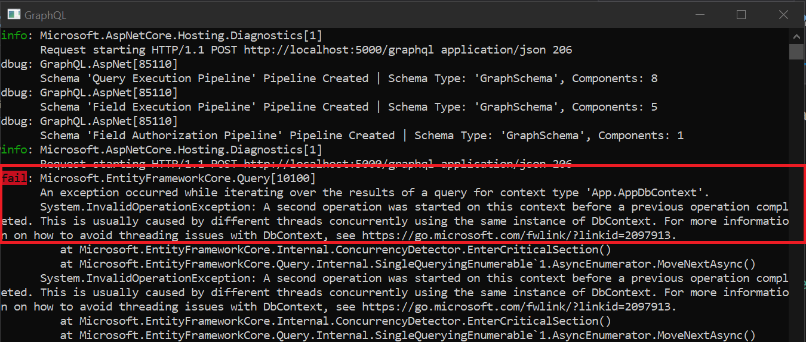

## DbContext and Parallel Query Operations
In a standard REST application we would register our `DbContext` like so:

```csharp title="Adding Entity Framework at Startup"
// highlight-next-line
services.AddDbContext<AppDbContext>(o =>
{
    o.UseSqlServer("<connectionString>");
});
```
This default registration adds the `DbContext` to the DI container is as a `Scoped` service. Meaning one instance is generated per Http request. However, consider the following graph controller and query:


```csharp title="FoodController.cs"
public class FoodController : GraphController
{    
    private AppDbContext _context;
    public FoodController(AppDbContext context){/**/}

    [QueryRoot]
    // highlight-next-line
    public IFood SearchMeat(string name){/**/}

    [QueryRoot]
    // highlight-next-line
    public IFood SearchVeggies(string name){/**/}
}
```

```graphql title="Sample Query"
query {
    # highlight-next-line
    searchMeat(name: "steak*") {
        name
    }
    # highlight-next-line
    searchVeggies(name: "green*") {
        name
    }
}
```

The `FoodController` contains two action methods both of which are requested. Since this is a query and not a mutation, both top-level action methods are executed in parallel. This can result in an exception being thrown:



This is caused by graphql attempting to execute both controller actions simultaneously. EF Core will reject multiple active queries. There are a few ways to address this and each comes with its own trade offs:

### Register DbContext as Transient

One way to correct this problem is to register your DbContext as a transient object.

```csharp title="Option 1: Register DbContext as Transient"
services.AddDbContext<AppDbContext>(
    options =>
    {
        options.UseSqlServer("<connectionString>");
    },
    // highlight-next-line
     ServiceLifetime.Transient);
```
Now each invocation will get its own DbContext and the queries can execute in parallel without issue. 

The tradeoff here is that you lose the singular scoped unit-of-work for the whole request granted by a shared context. 

If you have services registered to the DI container that make use of the DbContext you would want to register them as `Transient` as well lest one scoped service be created for the request trapping a single DbContext instance. Sometimes, however; this is unavoidable, especially with legacy code...

### Execute Controller Actions in Isolation
Another option is to instruct graphql to execute its controller actions in sequence, rather than in parallel. 

```csharp title="Option 2: Isolate GraphQL Controller Actions"
services.AddGraphQL(o =>
{
    // highlight-next-line
    o.ExecutionOptions.ResolverIsolation = ResolverIsolationOptions.ControllerActions;
});
```

This will instruct graphql to execute each encountered controller action one after the other. Your scoped `DbContext` would then be able to process the queries without issue.

The tradeoff with this method is a slight increase in processing time since the methods are called in sequence. All other field resolutions would be executed in parallel.

If your application has other resources or services that may have similar restrictions, it can be beneficial to isolate the other resolver types as well. You can add them to the ResolverIsolation configuration option as needed.
