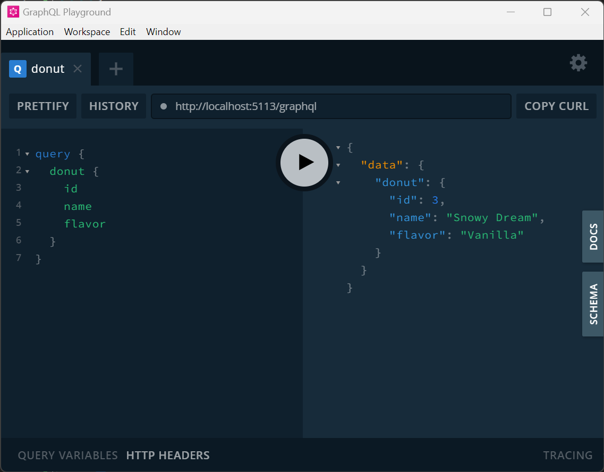

```powershell title="Install The Library"
# Using the dotnet CLI
> dotnet add package GraphQL.AspNet --prerelease

# using Package Manager Console
> Install-Package GraphQL.AspNet -IncludePrerelease
```

## Documentation

This documentation should can be used as a reference for various aspects of the library or read to discover the various features of the library.  If you have questions don't hesitate to ask over on [Github](https://github.com/graphql-aspnet/graphql-aspnet).


## Helpful Pages
<span style={{fontSize: "1.2em"}}> 

📌 [Demo Projects](../reference/demo-projects.md) : A number of downloadable sample projects covering a wide range of topics

💡 [Controllers](../controllers/actions.md) : Everything you need to know about `GraphController` and defining action methods.

📜 [Attributes](../reference/attributes.md) : A reference list of the various `[Attributes]` used by GraphQL ASP.NET to create your schema.

📐 [Schema Configuration](../reference/schema-configuration.md) : A reference list of the various configuration options available at application startup.

</span>

## Building Your First Application

### Create a new Web API Project
💻 Setup a new `ASP.NET Core Web API` project:


### Add the Package From Nuget
💻 Add the `GraphQL.AspNet` nuget package:

```powershell
# Powershell terminal, Package Manager in Visual Studio, Developer Command Prompt etc.
> dotnet add package GraphQL.AspNet --prerelease
```

### Create a Controller

💻 Create your first Graph Controller:

```csharp  title="BakeryController.cs"
using GraphQL.AspNet.Attributes;
using GraphQL.AspNet.Controllers;

public class BakeryController : GraphController
{
    [QueryRoot("donut")]
    public Donut RetrieveDonut()
    {
        return new Donut()
        {
            Id = 3,
            Name = "Snowy Dream",
            Flavor = "Vanilla"
        };
    }
}

public class Donut
{
    public int Id { get; set; }
    public string Name { get; set; }
    public string Flavor { get; set; }
}
```


### Configure Startup

💻 Register GraphQL with your services collection and your application pipeline:

```csharp title="Program.cs"
using GraphQL.AspNet.Configuration;

var builder = WebApplication.CreateBuilder(args);

// Add services to the container.
// highlight-next-line
builder.Services.AddGraphQL();

var app = builder.Build();

// Configure the HTTP request pipeline.
// highlight-next-line
app.UseGraphQL();
app.Run();
```


### Execute a Query

💻 Start the application and using your favorite tool, execute a query:

```graphql title="Sample Query"
query {
    donut {
        id
        name
        flavor
    }
}
```

#### Results:

