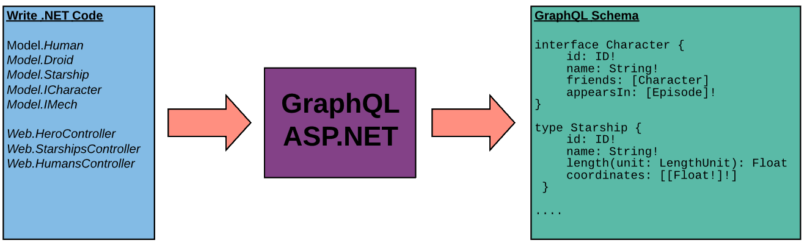

> This document is a high level overview how GraphQL ASP.NET ultimately generates a response to a query with some insight into core details. Its assumes a working knowledge of both ASP.NET and the GraphQL specification. If you are only interested in the "how to" for using the library, feel free to skip this.

## Schema Generation



#### Object Templating

When your application starts the runtime begins by inspecting the registered schemas declared in your `Startup.cs` for the different options you've declared and sets off gathering a collection of the possible graph types that may be required.

For each type it discovers, it generates a template that describes _how_ you've asked GraphQL to use your classes. By inspecting declared attributes and the `System.Type` metadata it generates the appropriate information to create everything GraphQL ASP.NET will need to fulfill a query. Information such as input and output parameters for methods, property types, custom type naming, implemented interfaces, union declarations, field path definitions, validation requirements and enforced authorization policies are all gathered and stored at the application level under the globally configured `IGraphTypeTemplateProvider`.

From this collection of metadata, GraphQL then generates the appropriate `IGraphType` objects for each of your schemas based on their individual configurations. By default, this completed a `ISchema` is stored as a singleton in your DI container.

**How does it know what objects to include?**

GraphQL ASP.NET has a few methods of determining what objects to include in your schema. By default, it will inspect your application (the entry assembly) for any public classes that inherit from `GraphController` or `GraphDirective` and work from there. It checks every tagged query and mutation method, looks at every return value and every method parameter to find relevant scalars, enums and object types then inspects each one in turn, deeper and deeper down your object chain, to create a full map. It will even inspect the arbitrary C# interfaces implemented on each of your consumed objects. If that interface is ever used as a return type on an action method or a property, its automatically promoted to a graph type and included in the schema.

You have complete control of what to include. Be that including additional assemblies, preventing the inclusion of the startup assembly, manually specifying each model class and controller etc. Attributes exist such as `[GraphSkip]` to exclude certain properties, methods or entire classes and limit the scope of the inclusion. On the other side of the fence, you can configure it to only accept classes with an explicitly declared `[GraphType]` attribute, ignoring everything else. And for the most control, disable everything and manually call `.AddType<T>()` at startup for each class you want to have in your schema (controllers included). GraphQL will then happily generate declaration errors when it can't find a reference declared in your controllers. This can be an effective technique in spotting data leaks or rogue methods that slipped through a code review. Configure a unit test to generate a schema with different inclusion rules per environment and you now have an automatic CI/CD check in place to give your developers more freedom to write code during a sprint and only have to worry about configurations when submitting a PR.

You can even go so far as to add a class to the schema but prevent its publication in introspection queries which can provide some helpful obfuscation. Alternatively, just disable introspection queries altogether. While this does cause client tooling to complain endlessly and makes front-end development much harder; if you and your consumers (like your UI) can agree ahead of time on the query syntax then there is no issue.

#### Middleware Pipelines

Similar to how ASP.NET utilizes a middleware pipeline to fulfill an HTTP request, GraphQL ASP.NET follows suit to fulfill a graphQL request. Major tasks like validation, parsing, field resolution and result packaging are just [middleware components](../reference/middleware) added to a chain of tasks and executed to complete the operation.

At the same time as its constructing your schema, GraphQL sets up the 4 primary pipelines and stores them in the DI container as an `ISchemaPipeline<TSchema, TContext>`. Each pipeline can be extended, reworked or completely replaced as needed for your use case.

## Query Execution

Query execution can be broken down into a series of phaes. For the sake of brevity we've left out the HTTP request steps required to invoke the GraphQL runtime but you can inspect the [DefaultGraphQLHttpProcessor](https://github.com/graphql-aspnet/graphql-aspnet/blob/master/src/graphql-aspnet/Defaults/DefaultGraphQLHttpProcessor%7BTSchema%7D.cs) and read through the code. 

Note: The concept of a phase here is just for organizing the information, there is no concrete "phase" value managed by the pipelines.

### Phase 1: Parsing & Validation

<div class="sideBySideCode hljs">
<div>

```csharp
// C# Controller
public class HeroController : GraphController
{
    [QueryRoot("hero")]
    public Human RetrieveHero(Episode episode)
    {
        if(episode == Episode.Empire)
        {
            return new Human()
            {
                Id = 1000,
                Name = "Han Solo",
                HomePlanet = "Corellia",
            }
        }
        else
        {
            return new Human()
            {
                Id = 1001,
                Name = "Luke SkyWalker",
                HomePlanet = "Tatooine",
            }
        }
    }
}
```

</div>
<div>

```js
// GraphQL Query Document
query {
    hero(episode: EMPIRE) {
        name
        homePlanet
    }
}
```

```js
// Generated Response
{
    "data" : {
        "hero": {
            "name" : "Han Solo",
            "homePlanet" : "Corellia"
        }
    }
}
```

</div>
</div>

_Sample query used as a reference example in this section_

The supplied query document (top right in the example) is ran through a compilation cycle to ultimately generate an `IGraphQueryPlan`. It is first lexed into a series of tokens representing the various parts; things like curly braces, colons, strings etc. Then it parses those tokens into a collection of `SyntaxNodes` (creating an Abstract Syntax Tree) representing concepts like `FieldNode`, `InputValueNode`, and `OperationTypeNode` following the [graphql specification rules for source text documents](https://spec.graphql.org/October2021/#sec-Source-Text).

Once parsed, the runtime will execute its internal rules engine against the generated `ISyntaxTree`, using the targeted `ISchema`, to create a query plan where it marries the nodes AST with concrete structures such as controllers, action methods and POCOs. It is at this stage where the `hero` field in the example is matched to the `HeroController` with its appropriate `IGraphFieldResolver` to invoke the `RetrieveHero` action method.

While generating a query plan the rules engine will do its best to complete an analysis of the entire document and return to the requestor every error it finds. Depending on the errors though, it may or may not be able to catch them all. For instance, a syntax error, like a missing `}`, will preclude generating a query plan so errors centered around invalid field names or a type expression mismatch won't be caught until the syntax error is fixed (just like any other compiler).

### Phase 2: Execution

The engine now has a completed query plan that describes:

-   The named operation in the document to be executed (or the single anonymous operation in the example above)
-   The top level fields and every child field on the chosen operation.

**Its successfully validated that:**

-   All the referenced fields for the graph types exist and are valid where requested
-   Required input arguments have been supplied and their data is "resolvable"
    -   This just means that we've validated that a number is a number, named fields on input objects exist etc.

**For each field, the runtime will:**

-   Substitute any deferred input arguments with referenced variable data
-   Generate a field execution context containing the necessary data about the source data, arguments and resolver.
-   Authenticate the user to the field.
-   Execute the resolver to fetch a data value.
-   Invoke any child fields requested.

#### Resolving a Field

GraphQL uses the phrase "resolver" to describe a method that, for a given field, takes in parameters and generates a result.

At startup, GraphQL ASP.NET automatically creates resolver references for your controller methods, POCO properties and tagged POCO methods. These are nothing more than delegates for method invocations; for properties it uses the getter registered with `PropertyInfo`.

> **_Performance Note_**: The library makes heavy use of compiled Expression Trees to call its resolvers and for instantiating input objects. As a result, its many orders of magnitude faster than baseline reflected calls and nearly as performant as precompiled code.

**Concerning Proxy Libraries (e.g. EF Core Proxies)**

GraphQL ASP.NET natively supports Liskov substitutions for all graph types opening up the possibility for using libraries such as EF Proxies that can provide a tremendously powerful and easy to setup graph structure. By lazy loading any child collections you can expose access to your entire domain model with very little work.

Be careful though, [EF Core Proxies](https://docs.microsoft.com/en-us/ef/core/querying/related-data/lazy) and like libraries suffer from the same N + 1 problem as GraphQL libraries do. By choosing to use such lazy loading techniques you are circumventing GraphQL ASP.NET's provided mechanisms for handling such situations and need to be exceptionally careful to manage the issue yourself.

### Phase 3: Response Generation

Once all fields have been processed the runtime makes a final pass to propagate any nullability errors up the field chain resulting in a final data set. This data set is then passed to the `IGraphResponseWriter` registered for the schema and the result is serialized to the HttpResponse.

**Writing a response includes:**

-   Serializing the `errors` generated during execution

    -   All error messages have a severity level. Your schema configuration controls which are sent to the client.
    -   You can add your own error messages through your controller actions by returning `this.Error()`.
    -   Error messages may or may not have associated exception data which may or may not be exposed to the client depending on who they are or the schema configuration settings.

-   Serializing the `data` field to the response stream

-   Serializing the `extensions` field (such as metrics data) to the response stream

## Other Points of Interest

Hopefully we've given you a bit of insight into how the library works under the hood. The other documents on this site go into exhaustive detail of the different features and how to use them but since you're here:

-   The library targets [`netstandard2.0`](https://docs.microsoft.com/en-us/dotnet/standard/net-standard) and `net6.0`.
    -   Out of the box there are no external dependencies beyond official Microsoft packages.

*   Every core component and all [middleware components](../reference/middleware.md) required to complete the tasks outlined in this document are referenced through dependency injection. Any one of them (or all of them) can be overridden and extended to do whatever you want as long as you register them prior to calling `.AddGraphQL()` at startup.

    -   Inject your own `IGraphResponseWriter` to serialize your results to XML or CSV.
    -   Build your own `IOperationComplexityCalculator` to intercept and alter how a query plan generates its [complexity values](../execution/malicious-queries) to be more suitable to your needs.
    -   On and on and on...

## Architectural Diagrams

<span style="font-size:20px;vertical-align: center;">&#128204;</span>&nbsp; [Structural Diagrams](../assets/2022-10-graphql-aspnet-structural-diagrams.pdf)

A set of diagrams outlining the major interfaces and classes that make up GraphQL Asp.Net.

<span style="font-size:20px;vertical-align: center;">&#128204;</span>&nbsp; [Execution Diagrams](../assets/2022-10-graphql-aspnet-execution-diagrams.pdf)

A set of flowcharts and relational diagrams showing how various aspects of the library fit together at run time, including the query execution and field execution pipelines.
