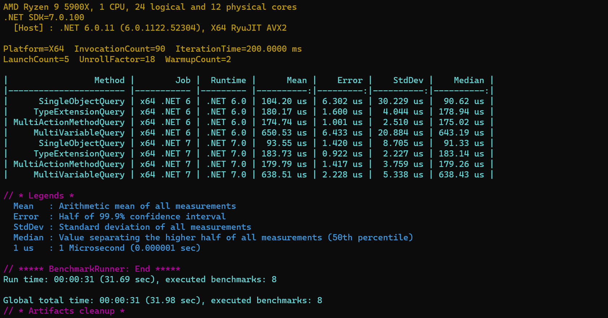

GraphQL ASP.NET is designed to be fast. The core library makes heavy use of `Span<T>` and `Memory<T>` to keep string allocations low while parsing a query document and building up a query plan. Similarly, when serializing results, the default response writer utilizes the new `System.Text.Json` namespace when writing to the response stream.

We're currently tracking three types of queries through the runtime to measure performance. These are executed against an in-memory data store without an attached database. We're trying to measure the ability of the library to process a query, not how long an action method takes to query a database for data. These queries are also executed **without** the query cache turned on.

The query explanation is below but as the graphic indicates all queries are **_executing in under a half-millisecond_** on average!


_Executed on:Intel Core i7-4790K CPU 4.00GHz (Haswell), 1 CPU, 8 logical and 4 physical cores. W/ 16gb RAM_

## SingleObjectQuery

A bare bones, single action method and resolution of a single returned object. 4 total field pipelines executed.

```
query {
    artist(id: 2) {
        id
        recordCompanyId
        name
    }
}
```

## MultiActionMethodQuery

A larger query instantiating 3 controller instances for 3 action methods.

This query involves:

-   Deserializing a JSON doc with one input variable conversion
-   Instantiating 3 controller instances and executing 3 action methods
-   11 field pipelines executed

```
query MultiArtistQuery($var1: String){
    artist1: artist(id: 2){
        id
        recordCompanyId
        name
    }
    artist2: artist(id: 1){
        id
        recordCompanyId
        name
    }
    allArtists: artists(searchText: $var1){
        id
        name
    }
}"

// variable document
{ "var1": "que" }

```

## TypeExtensionQuery

A query involving executing a batch operation and subsequent parsing of results to child objects.

This query involves:

-   Batch generation & resolution
-   4 field pipelines executed

```
# "records" is a a batch extension on the 'Artist' graph type
query {
    artists(searchText: ""queen"") {
        id
        name
        records {
            id
            name
            genre {
                id
                name
            }
        }
    }
}
```
